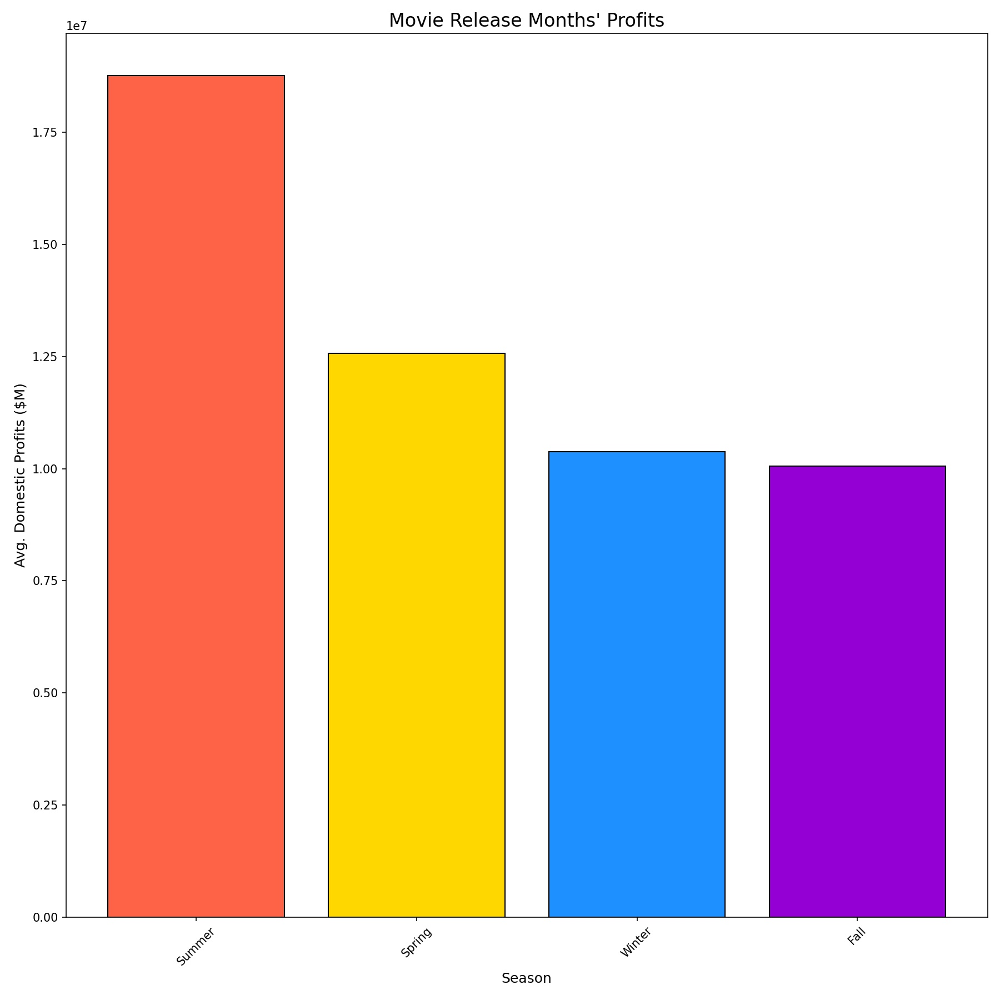

# The Path to Blockbuster: Navigating the Journey to Box Office Success

**Authors**: David Johnson and Norman Jen

## Overview

This project analyzes the profitability of different film genres at the box office. By examining the performance of various genres in terms of revenue generation, we aim to identify which types of films are currently experiencing the greatest success in the market. This analysis involves studying box office data to understand the financial performance of different genres and their respective profitability metrics. The goal is to provide actionable insights to the head of the company's new movie studio, enabling informed decision-making regarding the types of films to create in order to maximize commercial success.

## Business Problem


The business problem is to determine the optimal strategy for a new movie studio targeting the US market. This involves identifying the most profitable genre of film to produce, as well as the key writers and directors with a track record of success in that specific genre. Additionally, the studio needs to determine the most lucrative time of year for movie releases in terms of profitability. By addressing these questions, the studio aims to maximize its chances of commercial success and establish a strong presence in the competitive US film industry.

## Data

In this analysis, data was sourced from [IMDb](https://www.imdb.com/) and [The Numbers](https://www.the-numbers.com/). The IMDb dataset provides comprehensive details on movies, encompassing information on writers, directors, genres, country of origin, and average ratings for each film. Conversely, the Numbers dataset offers insights into box office performance metrics, such as production budgets and gross domestic revenue. Integrating these datasets offers a holistic understanding of movie performance, enabling analysis of factors influencing box office success.

## Methods

This project uses descriptive analysis. This will provide a useful overview of how successful a movie is.

## Results

The analysis highlights that Animation emerges as the most profitable genre, leading both in domestic and worldwide profit with an average of approximately $3.2 million and $2.5 million, respectively. Following closely behind is the musical genre, ranking third in domestic profit at around $2.5 million. This data strongly suggests that producing animation musicals, akin to successful films like Frozen and Moana, presents a promising opportunity for achieving success and profitability in the movie industry.


The analysis of the graph reveals that movies released during the summer season garnered the highest average domestic profit, indicating that summer releases were the most profitable at the box office, with an average profit of approximately $1.8 million. The data suggests a correlation between the genre preference of Animation and Musical films, which often cater to younger audiences, and the profitability of summer releases. This trend aligns with the fact that summer months coincide with school vacations, making it an opportune time for families and children to attend movies, resulting in higher average domestic profits for these genres during the summer season.



Cinco Paul and Ken Daurio, known for their collaborative work in writing, have collectively directed three out of the top 10 highest-grossing musical/animation films domestically. Their joint contributions as writers to movies such as The Secret Life of Pets, Despicable Me, Despicable Me 2, and Despicable Me 3 have significantly impacted the genre, accumulating a remarkable domestic profit of $957,588,000.00. Their impressive track record in crafting successful animated features makes them highly recommended choices for writing projects within the genre.

Chris Renaud and Pierre Coffin, both renowned directors in the realm of music/animation films, have each helmed three of the top 10 highest-grossing movies domestically within the genre. Chris Renaud directed The Secret Life of Pets, Despicable Me, and Despicable Me 2, collectively amassing a domestic profit of $767,963,700.00. On the other hand, Pierre Coffin directed Despicable Me, Despicable Me 2, and Despicable Me 3, generating a domestic profit of $664,203,670.00. Their combined contributions to these beloved animated features underscore their expertise and success in captivating audiences, making them formidable choices for directing projects in the music/animation genre.


These visuals can be viewed [here](https://public.tableau.com/views/AviationIncidentAnalysis/Dashboard1?:language=en-US&:display_count=n&:origin=viz_share_link) on our interactive Tablaue dashboard.


## Conclusion

This analysis leads to four recommendations for starting our movie production business:

- **Focus on musical and animation films.** The analysis indicates that producing animation musicals, inspired by hits like Frozen and Moana, presents a lucrative opportunity for success in the movie industry, with animation leading in both domestic and worldwide profits.
- **Release our movies during the summer time.** The analysis indicates that summer releases, coinciding with school vacations, garnered the highest average domestic profit, with Animation and Musical genres, appealing to younger audiences, particularly benefiting from this trend.
- **Choose writers with a proven track record.** Cinco Paul and Ken Daurio, having contributed as writers to three highly successful films within the top 10 Musical/Animation movies by domestic profits, including "The Secret Life of Pets," "Despicable Me 2," and "Despicable Me 3," are confidently recommended as writers for our film.
- **Choose directors with a proven track record.** Chris Renaud and Pierre Coffin each directed two of the top 10 Musical/Animation films by domestic profit, showcasing their expertise in directing successful films in the genre, with notable works including "Minions," "The Secret Life of Pets," and the "Despicable Me" franchise.

### Next Steps

Further analyses could yield additional insights to how we can further improve our movie production business:

- **Find the best voice actors/singers.** To find the best voice actors/singers, we could potentially conduct focus group testing to gather feedback and insights on their performances, helping us identify the most suitable candidates for our project.
- **Budget planning.** Develop a comprehensive budget plan outlining expenses for pre-production, production, and post-production stages.
- **Marketing strategy.** Develop a marketing plan to promote the film and generate buzz leading up to its release.

## For More Information

See the full analysis in the [Jupyter Notebook](./movie_analysis.ipynb) or review this [presentation](./movie_analysis_presentation.pdf).

## Repository Structure

```
├── images
├── zippedData
├── README.md
├── movie_analysis_presentation.pdf
└── movie_analysis.ipynb
```